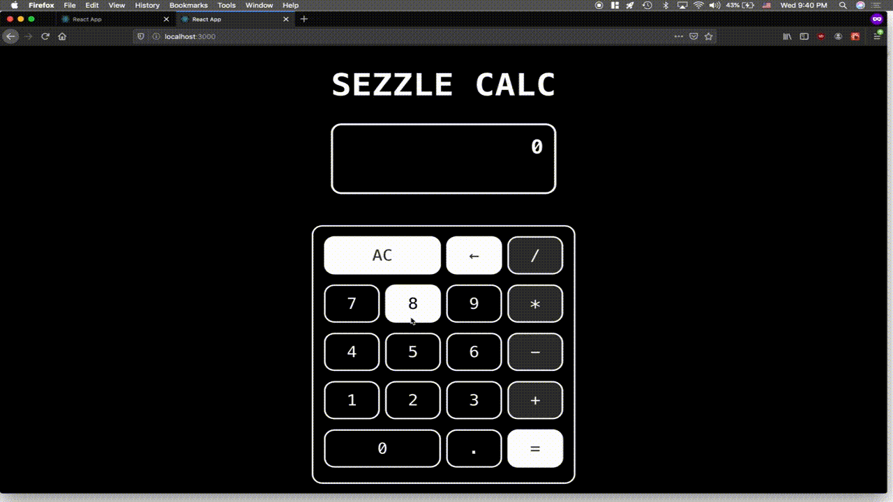

# Sezzle Calc

This full-stack project was a (language agnostic) coding challenge given to me by Sezzle. It is a calculator that allows multiple users to remotely make basic calculations and display the results for anyone else connected to see. It can be thought of as a WebSocket-based chat React app where the only form of communication is math operations. A live version of the project can be found at https://sezzle-collab-calc.netlify.com/
The original version of the project is [here.](https://github.com/mromerom/sezzle-collab-calc) There are very small differences between the two, and those were done for hosting/deployment purposes.

## Specifications

- Multiple users can add calculations.
- See calculations added in real time.
- Only the last 10 results should be displayed (from newest to oldest).
- The calculations must remain between sessions.

## Meeting the Specifications

The project is split up into a small backend built in node.js and using [Socket.IO](https://socket.io); and a frontend built using React and implementing [Hooks](https://reactjs.org/docs/hooks-reference.html) and [Context](https://reactjs.org/docs/context.html#when-to-use-context) as a solution for state management. Calculations are stored in a state array, and Socket.IO is used to allow real-time rendering of calculations across clients. Limiting the calculations displayed to 10 was done using `.slice`. There was no expectation or specification to allow user account creation; to avoid setting up a database and all the work that comes with that, calculations were maintained between sessions using client-side local storage in the browser.

## Hosting and Deployment

The backend was deployed using [Heroku](https://heroku.com) and the frontend was deployed using [Netlify](https://www.netlify.com). To deploy to Heroku it is sometimes necessary to create a [Procfile](https://devcenter.heroku.com/articles/procfile), in which the default language of the project being uploaded is specified. Additionally, when deploying to Netlify, it may necessary to create a build of the application and upload that instead of the entire project (as was the case with the frontend of this application).

## Motivation Behind Approach

Like most projects, there are multiple ways this challenge could have been solved. These are the reasons behind my approach.

- I chose to use React as a way to gain further knowledge and experience with Hooks and Context. State management has been a source of insecurity and discomfort for me in React from the start; I figured this challenge would be a great opportunity to learn how to use these new features from React 16.8+. I can't imagine managing state differently now.

- Real-time updates were the most challenging part for me. In all honesty, I wasn't sure how to solve this portion of the project, as I had never done anything of the sort. I got hung up on the collaborative aspect, which led me to spend some time looking into TogetherJS from Mozilla. However, this is closer to a screenshare-meets-google-docs solution, as opposed to simply seeing data in real time. After realizing this and reading [a Medium article by Ethan Ryan](https://medium.com/@ethanryan/making-a-simple-real-time-collaboration-app-with-react-node-express-and-yjs-a261597fdd44), my first real approach was going to implement Yjs; but I ran into some issues setting this up, causing me to ditch this solution after a few hours. I wish I had realized earlier that this is really just a chat app with a calculator laid on top. Once I arrived at that conclusion, I followed a few videos and articles with the same solution at the core: Socket.IO. Learning what WebSockets are and their pivotal role in real-time applications has been enlightening and empowering.

- On persistence between sessions: I wanted to keep things fairly simple and avoid setting up user profiles, authentication, and a database. There was no requirement or indication that building something that robust was expected, and given how easy it is to save and retrieve data on the client side, it seemed fairly obvious to me to use `localStorage`.
